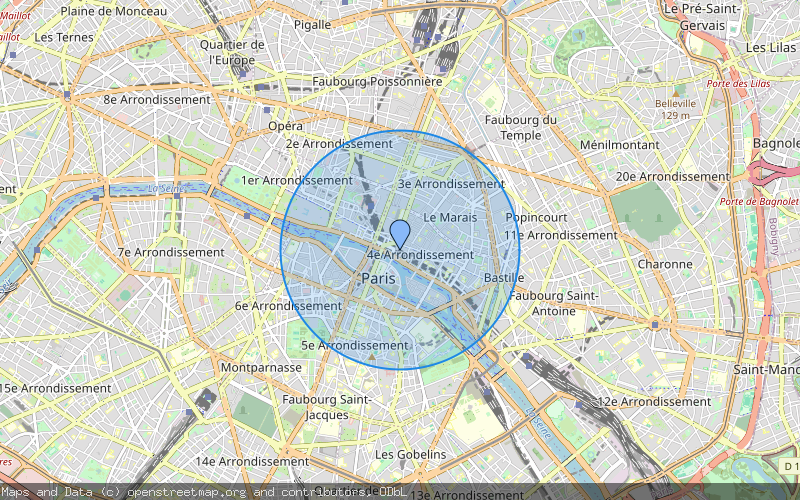

# staticmap

`staticmap` is a webserver written in Go to generate static maps from [OpenStreetMap](https://openstreetmap.org/) tiles. Its API is inspired by the [Google Static Maps API](https://developers.google.com/maps/documentation/static-maps/intro) but supports only a subset of the functions and parameters described there.

## API

All map operations are made against the `/map.png` endpoint of the server and are controlled by parameters:

| Parameter | Description |
| ---- | ---- |
| `center` | (required) Describes where to center the map. Must be given in decimal coordinates in format `lat,lon` (eg. `62.107733,-145.541936`) |
| `zoom` | (required) Describes the zoom level of the map. Must be a number between 1 and 16 like in the OpenStreetMap itself |
| `size` | (required) Output format of the requested map. Must be two numbers joined by an `x` (eg. `600x300`) - By default there is a limit to 1024px on each edge, you can set this in the parameters of the server. |
| `markers` | (optional) Marker definition, supports `size` and `color` attribute and marker positions must be given in format `lat,lon`. Elements of the marker definition are joined by a vertical bar. Valid sizes are `tiny, mid, small`. Valid colors are `black, brown, green, purple, yellow, blue, gray, orange, red, white` or a hex color in 3 or 6 letter notation: `0x333, 0x333333`. |
| `circles` | (optional) Circle definition, supports `radius`, `color`, `fill` and `weight` attributes. Center position must be given in format `lat,lon`. Elements are joined by a vertical bar. May be repeated for multiple circles. See [Circle parameters](#circle-parameters) below for details. |

### Circle parameters

Each `circles=...` value is a pipe-joined list (`key:value|...|lat,lon`). The `lat,lon` part has no prefix and is required (center of the circle). Other parts are optional and may appear in any order.

| Key | Description | Default |
| ---- | ---- | ---- |
| `radius` | Circle radius in **meters** (float). | `100` |
| `color` | Stroke color. Named color (same set as `markers`) or hex `0xRGB` / `0xRRGGBB` / `0xRRGGBBAA`. | `red` |
| `fill` | Fill color. Same accepted formats as `color`. | Stroke color with alpha `64` (~25 %). |
| `weight` | Stroke thickness in pixels (float). | `3` |

> **Note on alpha** — when you need transparency, use the 8-digit hex form `0xRRGGBBAA`. The server converts it to a non-premultiplied color, which avoids the saturated/halo rendering you would otherwise get with premultiplied alpha.

#### Examples

A Material-blue translucent circle of 1500 m around Paris, with a blue marker on the center:

```
/map.png
    ?center=48.8566,2.3522
    &zoom=13
    &size=800x500
    &markers=color:blue|48.8566,2.3522
    &circles=radius:1500|color:0x1e88e5|fill:0x1e88e533|weight:2|48.8566,2.3522
```



Three concentric circles (500 m green, 1500 m orange, 3000 m red):

```
/map.png
    ?center=48.8566,2.3522
    &zoom=12
    &size=800x500
    &circles=radius:500|color:0x43a047|fill:0x43a04733|weight:2|48.8566,2.3522
    &circles=radius:1500|color:0xfb8c00|fill:0xfb8c0033|weight:2|48.8566,2.3522
    &circles=radius:3000|color:0xe53935|fill:0xe5393533|weight:2|48.8566,2.3522
```

A named-color circle with an explicit translucent fill:

```
/map.png
    ?center=48.8566,2.3522
    &zoom=13
    &size=800x500
    &circles=radius:800|color:purple|fill:0xb196bf80|weight:3|48.8566,2.3522
```

### Example of a map having two different markers

```
/map.png
    ?center=53.5438,9.9768
    &zoom=15
    &size=800x500
    &markers=color:blue|53.54129165,9.98420576699353
    &markers=color:yellow|53.54565525,9.9680555636958
    &markers=size:tiny|color:red|53.54846472989871,9.978977621091543
```

The map center is set to a coordinate within Hamburg, Germany with a zoom level of 15. Additionally there are two markers set: One `blue` marker to the Elbphilharmonie, one `yellow` marker to the Hard Rock Cafe Hamburg and a `tiny` `red` marker on the St. Michaels church. The example above (of course without the line breaks) produced this image:


### Overlay support

Starting with version `v0.4.0` the generator supports map overlays for tiles based on transparent background (like [OpenFireMap](http://openfiremap.org/), [OpenSeaMap](http://www.openseamap.org/), ...). As those requests would be too complex for `GET` requests and are also not a common usecase they are implemented as `POST` requests containing a JSON object.

This example is generated with [OpenFireMap](http://openfiremap.org/) overlay tiles using the [`example/postmap.json`](example/postmap.json) file:


## Setup

- Build the Docker image locally from this repository: `docker build -t staticmap .`
- Or build the binary from source with `go build` from a clone of this repository

Afterwards just see `staticmap --help` (or `docker run --rm -ti staticmap --help`) for commandline parameters.

----


